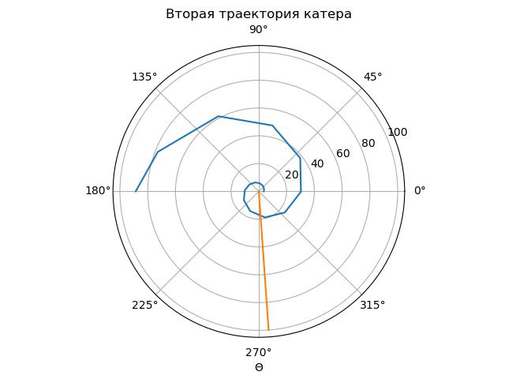

---
## Front matter
title: "Отчёт по лабораторной работе"
subtitle: "Лабораторная работа № 2"
author: "Живцова Анна"

## Generic otions
lang: ru-RU
toc-title: "Содержание"

## Bibliography
bibliography: bib/cite.bib
csl: pandoc/csl/gost-r-7-0-5-2008-numeric.csl

## Pdf output format
toc: true # Table of contents
toc-depth: 2
lof: true # List of figures
lot: true # List of tables
fontsize: 12pt
linestretch: 1.5
papersize: a4
documentclass: scrreprt
## I18n polyglossia
polyglossia-lang:
  name: russian
  options:
	- spelling=modern
	- babelshorthands=true
polyglossia-otherlangs:
  name: english
## I18n babel
babel-lang: russian
babel-otherlangs: english
## Fonts
mainfont: PT Serif
romanfont: PT Serif
sansfont: PT Sans
monofont: PT Mono
mainfontoptions: Ligatures=TeX
romanfontoptions: Ligatures=TeX
sansfontoptions: Ligatures=TeX,Scale=MatchLowercase
monofontoptions: Scale=MatchLowercase,Scale=0.9
## Biblatex
biblatex: true
biblio-style: "gost-numeric"
biblatexoptions:
  - parentracker=true
  - backend=biber
  - hyperref=auto
  - language=auto
  - autolang=other*
  - citestyle=gost-numeric
## Pandoc-crossref LaTeX customization
figureTitle: "Рис."
tableTitle: "Таблица"
listingTitle: "Листинг"
lofTitle: "Список иллюстраций"
lotTitle: "Список таблиц"
lolTitle: "Листинги"
## Misc options
indent: true
header-includes:
  - \usepackage{indentfirst}
  - \usepackage{float} # keep figures where there are in the text
  - \floatplacement{figure}{H} # keep figures where there are in the text
---

# Цель работы

Изучить основы языков программирования Julia и OpenModelica. 
Освоить основные библиотеки вышеприведенных языков для решения дифференциальных уравнений и построения графиков.
Закрепить на практике полученный знания.
Решить физическую задачу с использованием программных средств. 

# Задание

На море в тумане катер береговой охраны преследует лодку браконьеров. Через определенный промежуток времени туман рассеивается, и лодка обнаруживается на расстоянии 7,5 км от катера. Затем лодка снова скрывается в тумане и уходит прямолинейно в неизвестном направлении. Известно, что скорость катера в 3,1 раза больше скорости браконьерской лодки.    
1. Записать уравнение, описывающее движение катера, с начальными условиями для двух случаев (в зависимости от расположения катера относительно лодки в начальный момент времени).     
2. Построить траекторию движения катера и лодки для двух случаев.     
3. Найти точку пересечения траектории катера и лодки     

# Теоретическое введение

**Julia** — высокоуровневый высокопроизводительный свободный язык программирования с динамической типизацией, созданный для математических вычислений. Эффективен также и для написания программ общего назначения. Синтаксис языка схож с синтаксисом других математических языков (например, MATLAB и Octave), однако имеет некоторые существенные отличия. Julia написан на Си, C++ и Scheme. Имеет встроенную поддержку многопоточности и распределённых вычислений, реализованные в том числе в стандартных конструкциях.    
**OpenModelica** — свободное открытое программное обеспечение для моделирования, симуляции, оптимизации и анализа сложных динамических систем. Основано на языке Modelica. Активно развивается Open Source Modelica Consortium, некоммерческой неправительственной организацией. Open Source Modelica Consortium является совместным проектом RISE SICS East AB и Линчёпингского университета. По своим возможностям приближается к таким вычислительным средам как Matlab Simulink, Scilab xCos, имея при этом значительно более удобное представление системы уравнений исследуемого блока.     

# Выполнение лабораторной работы

## Математическая постановка задачи

1. Примем за момент отсчета времени момент первого рассеивания тумана.     
2. Введем полярные координаты с центром в точке нахождения браконьеров и осью, проходящей через катер береговой охраны.
Тогда начальные координаты катера (7.5; 0).  Обозначим скорость лодки $v$  
3. Траектория катера должна быть такой, чтобы и катер, и лодка все время
были на одном расстоянии от полюса. Только в этом случае траектория
катера пересечется с траекторией лодки.
Поэтому для начала катер береговой охраны должен двигаться некоторое
время прямолинейно, пока не окажется на том же расстоянии от полюса, что
и лодка браконьеров. После этого катер береговой охраны должен двигаться
вокруг полюса удаляясь от него с той же скоростью, что и лодка
браконьеров.
4. Чтобы найти расстояние x (расстояние после которого катер начнет
двигаться вокруг полюса), необходимо составить следующие уравнение. Пусть
через время t катер и лодка окажутся на одном расстоянии x от полюса. За
это время лодка пройдет x, а катер 7.5 + x (или 7.5 - x, в зависимости от
начального положения катера относительно полюса). Время, за которое они
пройдут это расстояние, вычисляется как $x / v$ или $7.5 - x / 3.1v (7.5 + x / 3.1v)$. 
Так как время одно и то же, то эти величины одинаковы.
Тогда неизвестное расстояние x можно найти из следующих уравнений:
$$\frac{x}{v} = \frac{7.5 + x}{3.1v}$$
$$\frac{x}{v} = \frac{7.5 - x}{3.1v}$$
Отсюда имеем $x_1 = \frac{75}{21}$, $x_2 = \frac{75}{41}$. Задачу будем решать для двух случаев.
5. После того, как катер береговой охраны окажется на одном расстоянии от
полюса, что и лодка, он должен сменить прямолинейную траекторию и
начать двигаться вокруг полюса удаляясь от него со скоростью лодки v.
Для этого скорость катера раскладываем на две составляющие: $v_r = \frac{dr}{dt} = v$ -
радиальная скорость и $v_{\tau} = r\frac{d\theta}{dt}$ - тангенциальная скорость. 
$$v_{\tau} = \sqrt{8.61}v$$
6. Решение исходной задачи сводится к решению системы из двух
дифференциальных уравнений
$$
\begin{cases}
  \frac{dr}{dt} = v \\
  r\frac{d\theta}{dt} = \sqrt{8.61}v
\end{cases} $$
с начальными условиями
$$
\begin{cases}
  \theta_0 = 0 \\
  r_0 = x_1
\end{cases}$$
или
$$
\begin{cases}
  \theta_0 = -\pi \\
  r_0 = x_2
\end{cases}$$
Исключая из полученной системы производную по t, можно перейти к
следующему уравнению:
$$\frac{dr}{d\theta} = \frac{r}{\sqrt{8.61}}$$
Начальные условия остаются прежними. Решив это уравнение, мы получим
траекторию движения катера в полярных координатах.

## Решение программными средствами

1.Решаем дифференциальное уравнение на языке Julia с использованием библиотеки DifferentialEquations. \
  using PyPlot;    
  using DifferentialEquations;    
  \
  function F(u, p, T)    
    return u/√(8.61)   
  end    
  \
  const r_1 = 75/41    
  const r_2 = 75/21    
  const T = (0, 3π)    
  \
  prob1 = ODEProblem(F, r_1, T)    
  prob2 = ODEProblem(F, r_2, T)    
  \
  sol1 = solve(prob1, abstol=1e-8, reltol=1e-8)    
  sol2 = solve(prob2, abstol=1e-8, reltol=1e-8);    
  \
  polar(sol1.t, sol1.u)    
  polar(fill(-1.5, 6), collect(0: 10: 50))    
  xlabel("$\theta$")    
  title("Вторая траектория")    
  savefig("kater2.jpg")    
  \
  polar(sol2.t, sol2.u)    
  polar(fill(-1.5, 11), collect(0: 10: 100))    
  xlabel("$\theta$")    
  title("Вторая траектория")    
  savefig("kater2.jpg")    

{#fig:01} 
{#fig:02}   

# Выводы

Произведен вывод дифференциальных уравнений для решения поставленной задачи.
На примере решения задачи о погоне отработано использование инструментов языков Julia.
Результат визуализирован с помощью средств библиотеки PyPlot.

# Список литературы{.unnumbered}

1. [Wikipedia Julia](https://ru.wikipedia.org/wiki/Julia_(язык_программирования)){#refs:julia}    
2. [Wikipedia OpenModelica](https://ru.wikipedia.org/wiki/OpenModelica){#refs:openmodelica}   
3. [Julia tutorial](https://julialang.org/learning/tutorials/){#refs:julia-tutorial}   
4. [OpenModelica tutorial](https://spoken-tutorial.org/tutorial-search/?search_foss=OpenModelica&search_language=English){#refs:openmodelica-tutorial}
