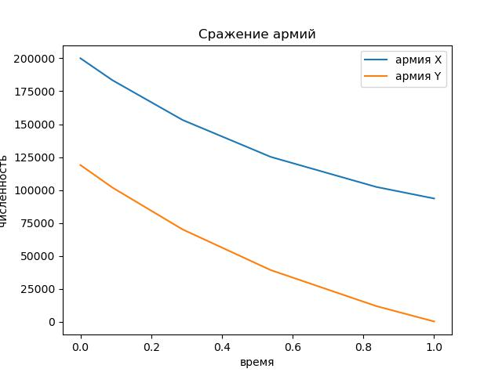
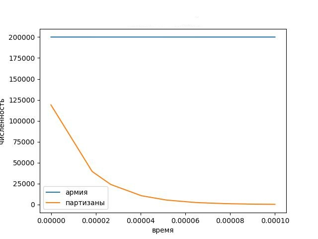
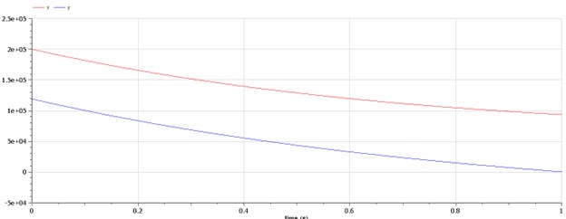

---
## Front matter
title: "Отчёт по лабораторной работе"
subtitle: "Лабораторная работа № 3"
author: "Живцова Анна"

## Generic otions
lang: ru-RU
toc-title: "Содержание"

## Bibliography
bibliography: bib/cite.bib
csl: pandoc/csl/gost-r-7-0-5-2008-numeric.csl

## Pdf output format
toc: true # Table of contents
toc-depth: 2
lof: true # List of figures
lot: true # List of tables
fontsize: 12pt
linestretch: 1.5
papersize: a4
documentclass: scrreprt
## I18n polyglossia
polyglossia-lang:
  name: russian
  options:
	- spelling=modern
	- babelshorthands=true
polyglossia-otherlangs:
  name: english
## I18n babel
babel-lang: russian
babel-otherlangs: english
## Fonts
mainfont: PT Serif
romanfont: PT Serif
sansfont: PT Sans
monofont: PT Mono
mainfontoptions: Ligatures=TeX
romanfontoptions: Ligatures=TeX
sansfontoptions: Ligatures=TeX,Scale=MatchLowercase
monofontoptions: Scale=MatchLowercase,Scale=0.9
## Biblatex
biblatex: true
biblio-style: "gost-numeric"
biblatexoptions:
  - parentracker=true
  - backend=biber
  - hyperref=auto
  - language=auto
  - autolang=other*
  - citestyle=gost-numeric
## Pandoc-crossref LaTeX customization
figureTitle: "Рис."
tableTitle: "Таблица"
listingTitle: "Листинг"
lofTitle: "Список иллюстраций"
lotTitle: "Список таблиц"
lolTitle: "Листинги"
## Misc options
indent: true
header-includes:
  - \usepackage{indentfirst}
  - \usepackage{float} # keep figures where there are in the text
  - \floatplacement{figure}{H} # keep figures where there are in the text
---

# Цель работы

Создать модель ведения боевых действий. Выразить математическими правилами динамику боевых действий в заданных условиях. 
Определить результат боя. Визуализировать динамику.  

# Задание

Между страной Х и страной У идет война. Численность состава войск
исчисляется от начала войны, и являются временными функциями x(t) и y(t) . В
начальный момент времени страна Х имеет армию численностью 200 000 человек,
а в распоряжении страны У армия численностью в 119 000 человек. Для упрощения
модели считаем, что коэффициенты потерь армий (связанных и несвязанных с боевыми действиями) постоянны. Также считаем, что поступление новых солдат в обе армии - непрерывные функции.    
Постройте графики изменения численности войск армии Х и армии У для
следующих случаев:    
1. Модель боевых действий между регулярными войсками.    
2. Модель ведение боевых действий с участием регулярных войск и
партизанских отрядов

# Теоретическое введение

Законы Ланчестера (законы Осипова — Ланчестера) — математическая формула для расчета относительных сил пары сражающихся сторон — подразделений вооруженных сил. В статье «Влияние численности сражающихся сторон на их потери», опубликованной журналом «Военный сборник» в 1915 году, генерал-майор Корпуса военных топографов М. П. Осипов. описал математическую модель глобального вооружённого противостояния, практически применяемую в военном деле при описании убыли сражающихся сторон с течением времени и, входящую в математическую теорию исследования операций, на год опередив английского математика Ф. У. Ланчестера. Мировая война, две революции в России не позволили новой власти заявить в установленном в научной среде порядке об открытии царского офицера. @lit1

Уравнения Ланчестера — это дифференциальные уравнения, описывающие зависимость между силами сражающихся сторон A и D как функцию от времени, причем функция зависит только от A и D.

В 1916 году, в разгар первой мировой войны, Фредерик Ланчестер разработал систему дифференциальных уравнений для демонстрации соотношения между противостоящими силами. Среди них есть так называемые Линейные законы Ланчестера (первого рода или честного боя, для рукопашного боя или неприцельного огня) и Квадратичные законы Ланчестера (для войн начиная с XX века с применением прицельного огня, дальнобойных орудий, огнестрельного оружия). @lit2


# Выполнение лабораторной работы

## Математическая постановка задачи

1. Модель боевых действий между регулярными войсками описывается следующей системой дифференциальных уравнений:
$$
\begin{cases}
\frac{dx}{dt} = -0.5x(t) - 0.8y(t) + \sin(t + 5) + 1 \\
\frac{dy}{dt} = -0.7x(t) - 0.5y(t) + \cos(t + 3) + 1
\end{cases}
$$
2. одель ведение боевых действий с участием регулярных войск и партизанских отрядов задается системой
$$
\begin{cases}
\frac{dx}{dt} = -0.5x(t) - 0.8y(t) + \sin(10t)\\
\frac{dy}{dt} = -0.3x(t)y(t) - 0.5y(t) + \cos(10t)
\end{cases}
$$

## Решение программными средствами

1.Решаем дифференциальное уравнение на языке Julia с использованием библиотеки DifferentialEquations. \
```julia
  using PyPlot;    
  using DifferentialEquations;    
  
  function lorenz!(du,u,p,t)    
    du[1] = -0.5*u[1] - 0.8*u[2] + sin(t + 5) + 1    
    du[2] =  -0.7*u[1] - 0.5*u[2] + cos(t + 3) + 1    
  end    
  
  u0 = [200000, 119000]    
  tspan = (0.0,  1.0)    
  prob = ODEProblem(lorenz!,u0,tspan)    
  sol = solve(prob);       
  
  plot(sol.t, sol.u, label= ["армия X", "армия Y"])     
  legend()    
  xlabel("время")    
  ylabel("численность")    
  title("Сражение армий")    
  savefig("battle1.jpg")    
```
{#fig:01} 

  ```julia
  function parameterized_lorenz!(du,u,p,t)    
    du[1] = -0.5*u[1] - 0.8*u[2] + sin(10*t)    
    du[2] =  -0.3*u[1]*u[2] - 0.5*u[2] + cos(10*t)    
  end    
  \
  u0 = [200000, 119000]    
  tspan = (0.0,  0.0001)    
  prob = ODEProblem(parameterized_lorenz!,u0,tspan)    
  sol = solve(prob);    
  \
  plot(sol.t, sol.u, label= ["армия", "партизаны"])    
  legend()    
  xlabel("время")     
  ylabel("численность")    
  title("Сражение армий")    
  savefig("battle2.jpg")     
```
{#fig:02} 

2.Реализация задачи на языке OpenModelica 
```openmodelica
model battle    
  Real x;    
  Real y;    
  Real t;    
initial equation    
  t = 0;    
  x = 200000;    
  y = 119000;    
equation    
  der(t) = 1;    
  der(x) = -0.5*x - 0.8*y + sin(t + 5) + 1;    
  der(y) =  -0.7*x - 0.5*y + cos(t + 3) + 1;    
end battle;       
```

{#fig:03} 

```openmodelica
model battle2    
  Real x;    
  Real y;    
  Real t;    
initial equation    
  t = 0;    
  x = 200000;    
  y = 119000;    
equation    
  der(t) = 1;    
  der(x) = -0.5*x - 0.8*y + sin(10*t);    
  der(y) =  -0.3*x*y - 0.5*y + cos(10*t);    
end battle2;    
```

{#fig:04} 

Видим, что, к счастью, решение в различных средах совпадает @fig:01 , @fig:02 , @fig:03 , @fig:04 . Видим, что в данных условиях армия с большей численностью побеждает. При этом партизаны проигрывают за очень малое время.     

# Выводы

Произведен вывод дифференциальных уравнений модели боевых действий между регулярными армиями и между регулярной армией и партизанскими отрядами. При заданых начальных условиях системы уравнений решены при помощи языков Julia и Openmodelica.
Зафиксирован исход боя. Результат визуализирован.


# Список литературы{.unnumbered}
::: {#refs}
:::
