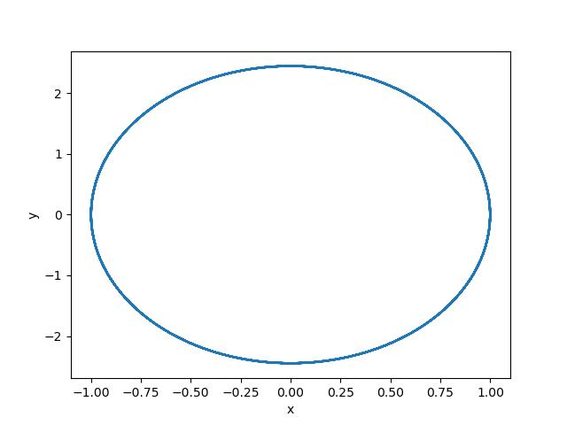
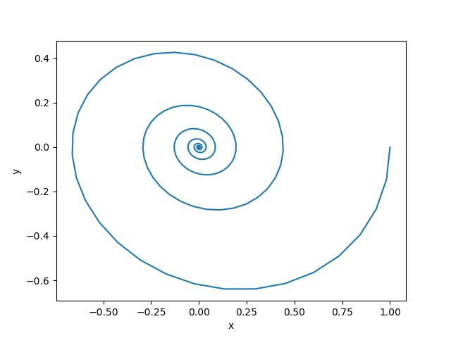
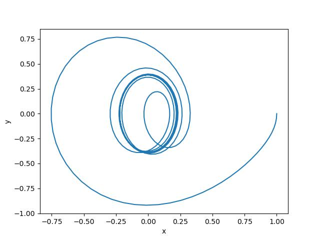
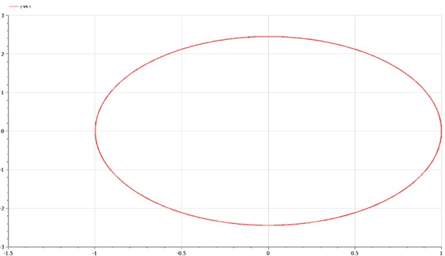
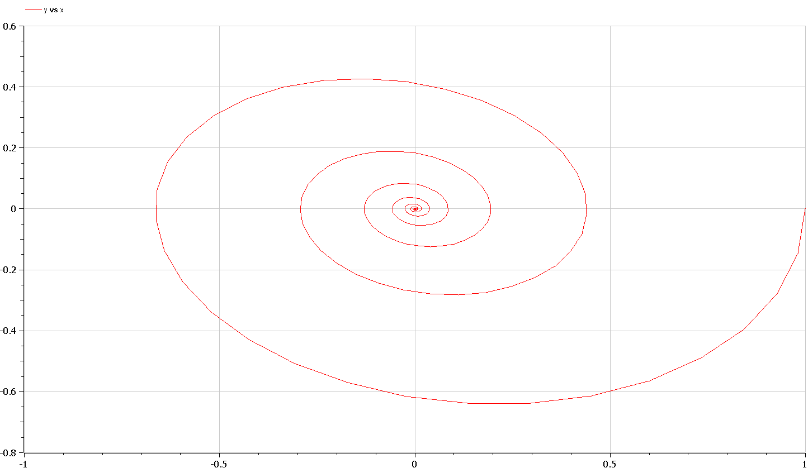
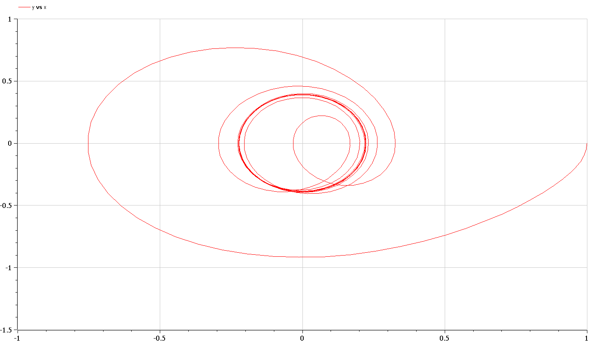

---
## Front matter
title: "Отчёт по лабораторной работе"
subtitle: "Лабораторная работа № 4"
author: "Живцова Анна"

## Generic otions
lang: ru-RU
toc-title: "Содержание"

## Bibliography
bibliography: bib/cite.bib
csl: pandoc/csl/gost-r-7-0-5-2008-numeric.csl

## Pdf output format
toc: true # Table of contents
toc-depth: 2
lof: true # List of figures
lot: true # List of tables
fontsize: 12pt
linestretch: 1.5
papersize: a4
documentclass: scrreprt
## I18n polyglossia
polyglossia-lang:
  name: russian
  options:
	- spelling=modern
	- babelshorthands=true
polyglossia-otherlangs:
  name: english
## I18n babel
babel-lang: russian
babel-otherlangs: english
## Fonts
mainfont: PT Serif
romanfont: PT Serif
sansfont: PT Sans
monofont: PT Mono
mainfontoptions: Ligatures=TeX
romanfontoptions: Ligatures=TeX
sansfontoptions: Ligatures=TeX,Scale=MatchLowercase
monofontoptions: Scale=MatchLowercase,Scale=0.9
## Biblatex
biblatex: true
biblio-style: "gost-numeric"
biblatexoptions:
  - parentracker=true
  - backend=biber
  - hyperref=auto
  - language=auto
  - autolang=other*
  - citestyle=gost-numeric
## Pandoc-crossref LaTeX customization
figureTitle: "Рис."
tableTitle: "Таблица"
listingTitle: "Листинг"
lofTitle: "Список иллюстраций"
lotTitle: "Список таблиц"
lolTitle: "Листинги"
## Misc options
indent: true
header-includes:
  - \usepackage{indentfirst}
  - \usepackage{float} # keep figures where there are in the text
  - \floatplacement{figure}{H} # keep figures where there are in the text
---

# Цель работы

Создать модель гармонического осциллятора в различных условиях. Задать и численно решить уравнения. Визуализировать результат.    

# Задание

Постройте фазовый портрет гармонического осциллятора и решение уравнения
гармонического осциллятора для следующих случаев    
1. Колебания гармонического осциллятора без затуханий и без действий внешней
силы $\ddot{x} + 6x = 0$         
2. Колебания гармонического осциллятора c затуханием и без действий внешней
силы $\ddot{x} + 5\dot{x} + 15x = 0$    
3. Колебания гармонического осциллятора c затуханием и под действием внешней
силы $\ddot{x} + 2\dot{x} + 4x = \cos(3.5t)$    
На интервале $t \in [0, 45]$ (шаг 0.05) с начальными условиями $x_0 = 1, \ y_0 = 0$    

# Теоретическое введение

**Осцилля́тор** (лат. oscillo — качаюсь) — система, совершающая колебания, то есть показатели которой периодически повторяются во времени.     
**Фазовое пространство** — это пространство, на котором представлено @lit1
множество всех состояний системы, т. е. каждая точка такого пространства задает состояние рассматриваемой физической системы.    
**Фазовая траектория** - кривая в фазовом пространстве, составленная из точек, представляющих состояние динамической системы в последовательные моменты времени в течение всего времени эволюции. @lit1        
**Фазовый портрет** системы – совокупность всех ее траекторий, изображенных в фазовом пространстве. @lit1     

# Выполнение лабораторной работы

## Математическая постановка задачи

Представим дифференциальные уравнения второго порядка к системе дифференциальных уравнений первого порядка.    
1. $$\ddot{x} + 6x = 0 \to 
\begin{cases}
\dot{x} = y \\
\dot{y} = -6x
\end{cases}$$       
2. $$\ddot{x} + 5\dot{x} + 15x = 0 \to 
\begin{cases}
\dot{x} = 5y \\
\dot{y} = -\dot{x} - 3x
\end{cases}$$     
3. $$\ddot{x} + 2\dot{x} + 4x = \cos(3.5t) \to 
\begin{cases}
\dot{x} = 2y \\
\dot{y} = -\dot{x} - 2x + \cos(3.5t) 
\end{cases}$$     

## Решение программными средствами

1.Решаем дифференциальное уравнение на языке Julia с использованием библиотеки DifferentialEquations. 
```julia
  using PyPlot;    
  using DifferentialEquations;    
  
  function lorenz!(du,u,p,t)    
  du[1] = u[2]    
  du[2] =  -6*u[1]    
  end    
  
  u0 = [1, 0]    
  tspan = (0.0,  45)    
  prob = ODEProblem(lorenz!,u0,tspan)    
  sol = solve(prob, reltol=1e-6,saveat=0.05);    
  
  plot([sol.u[j][\1] for j in collect(1:900)] , [sol.u[j][2] for j in collect(1:900)] )    
  xlabel("x")    
  ylabel("y")    
  savefig("oscillator1.jpg")   
  ``` 

{#fig:01} 

```julia
  function lorenz!(du,u,p,t)    
  du[1] = 5*u[2]    
  du[2] =  -u[2] - 3*u[1]    
  end    
  
  u0 = [1, 0]    
  tspan = (0.0,  45)    
  prob = ODEProblem(lorenz!,u0,tspan)    
  sol = solve(prob, reltol=1e-6,saveat=0.05);    
  
  plot([sol.u[j][1] for j in collect(1:900)] , [sol.u[j][2] for j in collect(1:900)] )    
  xlabel("x")    
  ylabel("y")    
  savefig("oscillator2.jpg") 
  ```   

{#fig:02} 

```julia
function lorenz!(du,u,p,t)    
  du[1] = 2*u[2]    
  du[2] =  -u[2] - 2*u[1] + cos(3.5*t)    
  end    
  
  u0 = [1, 0]    
  tspan = (0.0,  45)    
  prob = ODEProblem(lorenz!,u0,tspan)    
  sol = solve(prob, reltol=1e-6,saveat=0.05);    
  
  plot([sol.u[j][1] for j in collect(1:900)] , [sol.u[j][2] for j in collect(1:900)] )    
  xlabel("x")    
  ylabel("y")    
  savefig("oscillator3.jpg") 
  ```   

{#fig:03} 

2.Реализация задачи на языке OpenModelica 
```modelica
model oscillator1    
  Real x;    
  Real y;    
initial equation    
  x = 1;    
  y = 0;    
equation    
  der(x) = y;    
  der(y) =  -6*x;    
end oscillator1;    
```

{#fig:04} 

```
model oscillator2    
  Real x;    
  Real y;    
initial equation    
  x = 1;    
  y = 0;    
equation    
  der(x) = 5*y;    
  der(y) =  -y -3*x;    
end oscillator2;  
```      

{#fig:05} 

```
model oscillator3    
  Real x;    
  Real y;    
  Real t;    
initial equation    
  t = 0;    
  x = 1;    
  y = 0;    
equation    
  der(t) = 1;    
  der(x) = 2*y;    
  der(y) =  -y -2*x + cos(3.5*t);    
end oscillator3;   
```

{#fig:06} 
   

# Выводы

Получены фазовые портреты гармонического осцилятора в различных условиях @fig:01 , @fig:02 , @fig:03 . Произведено сравнение поведения гармонического осцилятора в зависимости от наличия внешней силы и затуханий  @fig:04 , @fig:05 , @fig:06 .    

# Список литературы{.unnumbered}

::: {#refs}
:::
