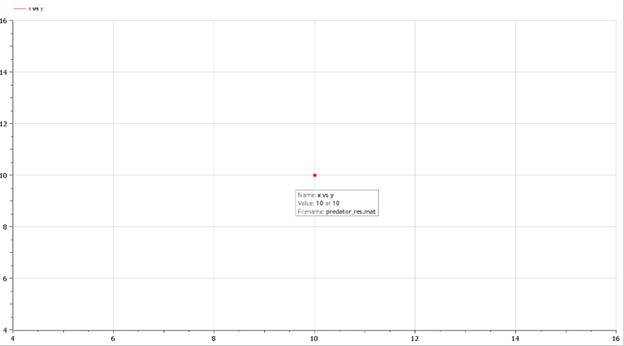

---
## Front matter
title: "Отчёт по лабораторной работе"
subtitle: "Лабораторная работа № 5"
author: "Живцова Анна"

## Generic otions
lang: ru-RU
toc-title: "Содержание"

## Bibliography
bibliography: bib/cite.bib
csl: pandoc/csl/gost-r-7-0-5-2008-numeric.csl

## Pdf output format
toc: true # Table of contents
toc-depth: 2
lof: true # List of figures
lot: true # List of tables
fontsize: 12pt
linestretch: 1.5
papersize: a4
documentclass: scrreprt
## I18n polyglossia
polyglossia-lang:
  name: russian
  options:
	- spelling=modern
	- babelshorthands=true
polyglossia-otherlangs:
  name: english
## I18n babel
babel-lang: russian
babel-otherlangs: english
## Fonts
mainfont: PT Serif
romanfont: PT Serif
sansfont: PT Sans
monofont: PT Mono
mainfontoptions: Ligatures=TeX
romanfontoptions: Ligatures=TeX
sansfontoptions: Ligatures=TeX,Scale=MatchLowercase
monofontoptions: Scale=MatchLowercase,Scale=0.9
## Biblatex
biblatex: true
biblio-style: "gost-numeric"
biblatexoptions:
  - parentracker=true
  - backend=biber
  - hyperref=auto
  - language=auto
  - autolang=other*
  - citestyle=gost-numeric
## Pandoc-crossref LaTeX customization
figureTitle: "Рис."
tableTitle: "Таблица"
listingTitle: "Листинг"
lofTitle: "Список иллюстраций"
lotTitle: "Список таблиц"
lolTitle: "Листинги"
## Misc options
indent: true
header-includes:
  - \usepackage{indentfirst}
  - \usepackage{float} # keep figures where there are in the text
  - \floatplacement{figure}{H} # keep figures where there are in the text
---

# Цель работы

Исследовать модель Лотки-Вольтерры "хищник - жертва". Выявить стационарное состояние системы. Изучить зависимости числа хищников и числа жертв.         

# Задание

В лесу проживают х число волков, питающихся зайцами, число которых в
этом же лесу у. Пока число зайцев достаточно велико, для прокормки всех волков,
численность волков растет до тех пор, пока не наступит момент, что корма
перестанет хватать на всех. Тогда волки начнут умирать, и их численность будет
уменьшаться. В этом случае в какой-то момент времени численность зайцев снова
начнет увеличиваться, что повлечет за собой новый рост популяции волков. Такой
цикл будет повторяться, пока обе популяции будут существовать. Помимо этого,
на численность стаи влияют болезни и старение.    
Постройте график зависимости численности хищников от численности жертв,
а также графики изменения численности хищников и численности жертв при
следующих начальных условиях: $x_0 = 4, \ y_0 = 9$. Найдите стационарное
состояние системы.   
Параметры модели заданы следующим образом:    
$$
\begin{cases}
\frac{dx}{dt} = -0.77x(t) + 0.077x(t)y(t) \\ 
\frac{dy}{dt} = 0.33x(t) - 0.033x(t)y(t)
\end{cases}
$$ 

# Теоретическое введение

Простейшая модель взаимодействия двух видов типа «хищник — жертва» -
модель Лотки-Вольтерры. Данная двувидовая модель основывается на
следующих предположениях:    
1. Численность популяции жертв x и хищников y зависят только от времени
(модель не учитывает пространственное распределение популяции на
занимаемой территории)    
2. В отсутствии взаимодействия численность видов изменяется по модели
Мальтуса, при этом число жертв увеличивается, а число хищников падает    
3. Естественная смертность жертвы и естественная рождаемость хищника
считаются несущественными    
4. Эффект насыщения численности обеих популяций не учитывается    
5. Скорость роста численности жертв уменьшается пропорционально
численности хищников @lit1   
$$
\begin{cases}
\frac{dx}{dt} = ax(t) - px(t)y(t) \\ 
\frac{dy}{dt} = -bx(t) + qx(t)y(t)
\end{cases}
$$
В этой модели x – число жертв, y - число хищников. Коэффициент a
описывает скорость естественного прироста числа жертв в отсутствие хищников, b
- естественное вымирание хищников, лишенных пищи в виде жертв. Вероятность
взаимодействия жертвы и хищника считается пропорциональной как количеству
жертв, так и числу самих хищников (xy). Каждый акт взаимодействия уменьшает
популяцию жертв, но способствует увеличению популяции хищников.    
Стационарное состояние системы (положение равновесия, не зависящее
от времени решение) будет в точке: $x_0 = \frac{b}{q}, \ y_0 = \frac{a}{p}$

# Выполнение лабораторной работы

## Математическое решение

Найдем стационарное состояние $x_0 = \frac{b}{q} = \frac{0.33}{0.033} = 10, \ y_0 = \frac{a}{p} = \frac{0.77}{0.077} = 10$.

## Решение программными средствами

1.Решаем дифференциальное уравнение на языке Julia с использованием библиотеки DifferentialEquations. \
  using PyPlot;    
  using DifferentialEquations;    
  \
  function lorenz!(du,u,p,t)    
  du[1] = -0.77*u[1] + 0.077*u[1]*u[2]    
  du[2] =  0.33*u[2] - 0.033*u[1]*u[2]    
  end    
  \
  u0 = [4, 9]    
  tspan = (0.0,  100)    
  prob = ODEProblem(lorenz!,u0,tspan)    
  sol = solve(prob, reltol=1e-6,saveat=0.05);    
  \
  plot([sol.u[j][2] for j in collect(1:2000)] , [sol.u[j][1] for j in collect(1:2000)])    
  xlabel("жертвы")    
  ylabel("хищники")    
  savefig("predator1.jpg")    

{#fig:01} 

  plot(sol.t, sol.u, label = ["хищники", "жертвы"])    
  legend()    
  xlabel("время")    
  ylabel("численность")    
  savefig("predator2.jpg")    

{#fig:02} 

2.Реализация задачи на языке OpenModelica \    
model predator    
  Real x;    
  Real y;    
initial equation    
  x = 4;    
  y = 9;    
equation    
  der(x) = -0.77*x + 0.077*x*y;    
  der(y) = 0.33*y - 0.033*x*y;    
end predator;    

{#fig:04} 

{#fig:05} 

Проверим найденное стационарное состояние системы

{#fig:03} 

# Выводы

Исследована зависимость численности популяций хищниов и жертв в модели Лотки-Вольтерры @fig:01 / @fig:04 , @fig:02 / @fig:05  . Подтверждены теоретические выводы о существовании стационарной тички и колебательной природе числа особей в популяции. @fig:03   

# Список литературы{.unnumbered}

::: {#refs}
:::    
