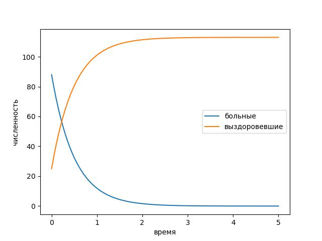
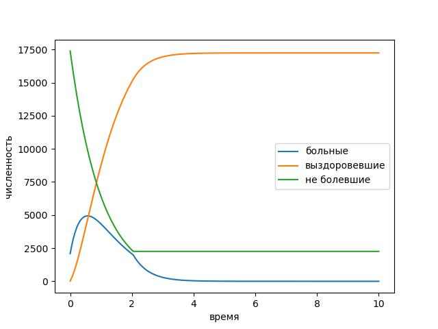

---
## Front matter
title: "Отчёт по лабораторной работе"
subtitle: "Лабораторная работа № 6"
author: "Живцова Анна"

## Generic otions
lang: ru-RU
toc-title: "Содержание"

## Bibliography
bibliography: bib/cite.bib
csl: pandoc/csl/gost-r-7-0-5-2008-numeric.csl

## Pdf output format
toc: true # Table of contents
toc-depth: 2
lof: true # List of figures
lot: true # List of tables
fontsize: 12pt
linestretch: 1.5
papersize: a4
documentclass: scrreprt
## I18n polyglossia
polyglossia-lang:
  name: russian
  options:
	- spelling=modern
	- babelshorthands=true
polyglossia-otherlangs:
  name: english
## I18n babel
babel-lang: russian
babel-otherlangs: english
## Fonts
mainfont: PT Serif
romanfont: PT Serif
sansfont: PT Sans
monofont: PT Mono
mainfontoptions: Ligatures=TeX
romanfontoptions: Ligatures=TeX
sansfontoptions: Ligatures=TeX,Scale=MatchLowercase
monofontoptions: Scale=MatchLowercase,Scale=0.9
## Biblatex
biblatex: true
biblio-style: "gost-numeric"
biblatexoptions:
  - parentracker=true
  - backend=biber
  - hyperref=auto
  - language=auto
  - autolang=other*
  - citestyle=gost-numeric
## Pandoc-crossref LaTeX customization
figureTitle: "Рис."
tableTitle: "Таблица"
listingTitle: "Листинг"
lofTitle: "Список иллюстраций"
lotTitle: "Список таблиц"
lolTitle: "Листинги"
## Misc options
indent: true
header-includes:
  - \usepackage{indentfirst}
  - \usepackage{float} # keep figures where there are in the text
  - \floatplacement{figure}{H} # keep figures where there are in the text
---

# Цель работы

Создать модель распространения эпидемии в условиях ограниченного количества людей. Исследовать динамику протекания эпидемии для заданных начальных числовых параметров.         

# Задание

На одном острове вспыхнула эпидемия. Известно, что из всех проживающих
на острове (N=19500) в момент начала эпидемии (t=0) число заболевших людей
(являющихся распространителями инфекции) I(0)=88, А число здоровых людей с
иммунитетом к болезни R(0)=25. Таким образом, число людей восприимчивых к
болезни, но пока здоровых, в начальный момент времени S(0)=N-I(0)- R(0).
Постройте графики изменения числа особей в каждой из трех групп.
Рассмотрите, как будет протекать эпидемия в случае:     
1) если $I(0) \leq I^*$    
2) если $I(0) > I^*$    

# Теоретическое введение

Для моделирования эпидемии @lit1 разделим людей на три категории:   
- это восприимчивые к болезни, но пока здоровые особи S(t)    
- инфицированные особи I(t)    
- здоровые особи с иммунитетом к болезни R(t)  @lit2   

Обозначим через $\alpha, \ \beta$ - коэффициенты заражения и выздоровления    

До того, как число заболевших не превышает критического значения
I*, считаем, что все больные изолированы и не заражают здоровых. Иначе больные способны заражать восприимчивых к болезни особей.
Таким образом, приходим к уравнениям: 
\begin{equation}
\frac{dS}{dt} = \begin{cases}
-\alpha * S, \ I(t) > I^* \\
0, I(t) \leq I^*
\end{cases}
\end{equation}

\begin{equation}
\frac{dI}{dt} = \begin{cases}
-\alpha * S - \beta*I, \ I(t) > I^* \\
-\beta*I, I(t) \leq I^*
\end{cases}
\end{equation}

\begin{equation}
\frac{dI}{dt} = \beta*I
\end{equation}

# Выполнение лабораторной работы

## Математическая постановка задачи

Примем за критическое значение 10% всех особей.      
Также введем коэффициенты заболеваемости и выздоровления соответственно равными 1 и 2.      

## Решение программными средствами

1.Решаем дифференциальное уравнение на языке Julia с использованием библиотеки DifferentialEquations. 
```julia
using PyPlot;
using DifferentialEquations;

function lorenz!(du,u,p,t)
    if u[1] > 2000
        du[3] = -u[3]
        du[1] = u[3] - 2*u[1]
    else
         du[1] =  - 2*u[1]
         du[3] = 0
    end
    du[2] = 2*u[1]
end

u0 = [88, 25, 19500-88-25]
tspan = (0.0,  5.0)
prob = ODEProblem(lorenz!,u0,tspan)
sol = solve(prob, reltol=1e-6,saveat=0.05);

plot(sol.t , [sol.u[j][1] for j in collect(1:101)] , label = "больные")
plot(sol.t, [sol.u[j][2] for j in collect(1:101)] , label =  "выздоровевшие")
legend()
xlabel("время")
ylabel("численность")
savefig("covid.jpg")

u0 = [2088, 25, 19500-2088-25]
tspan = (0.0,  10.0)
prob = ODEProblem(lorenz!,u0,tspan)
sol = solve(prob, reltol=1e-6,saveat=0.05);

plot(sol.t, sol.u, label = ["больные", "выздоровевшие", "не болевшие"])
legend()
xlabel("время")
ylabel("численность")
savefig("covid2.jpg")
```

{#fig:01} 

{#fig:02} 

2.Реализация задачи на языке OpenModelica 
```modelica
model covid
  parameter Real Num = 19500;
  parameter Real alpha = 1;
  parameter Real betta = 2;
  parameter Real crit = 2000;
  Real I;
  Real R;
  Real S;
initial equation
  I = 88; // случай 1
  //I = 2088; случай 2
  R = 25;
  S = Num - I - R;
equation
  if I > crit then
    der(S) = -alpha*S;
    der(I) = alpha*S - betta*I;
  else
    der(S) = 0;
    der(I) = -betta*I;
  end if;
  der(R) = betta*I;
end covid;
```

{#fig:03} 

{#fig:04} 


# Выводы

Построена модель распространения эпидемии. Получено наглядное @fig:03 @fig:04 представление о динамике численности зараженных, здоровых и выздоровевших групп населения при различных условиях начала пандемии @fig:01 @fig:02.     

# Список литературы{.unnumbered}

:::{#refs}
:::    
