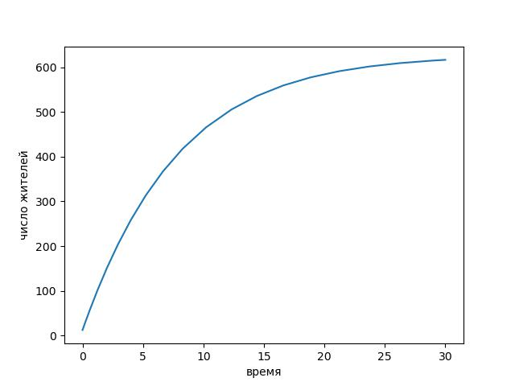
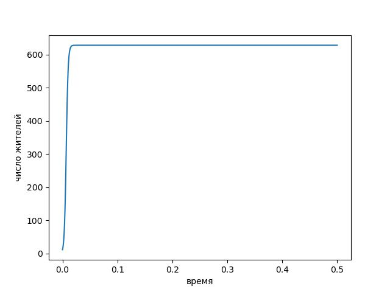
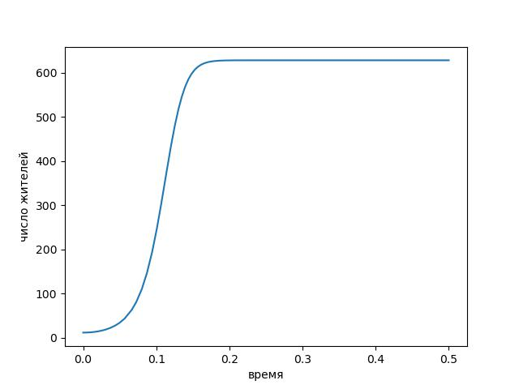
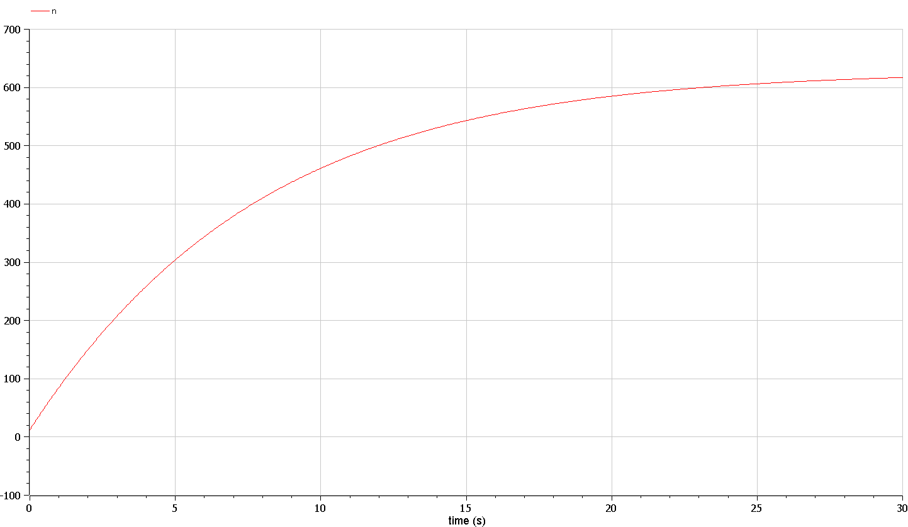
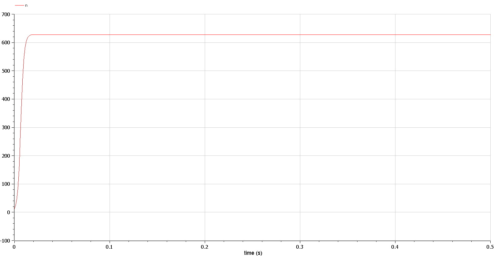
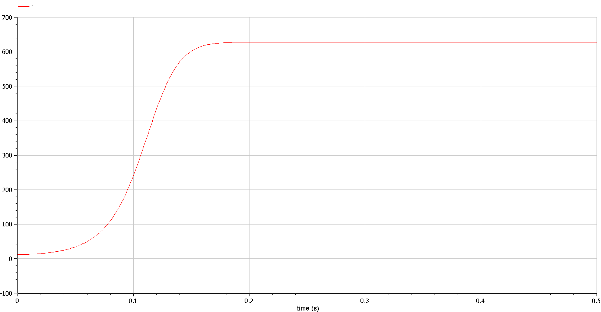
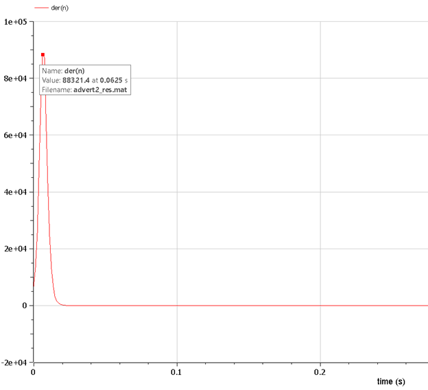

---
## Front matter
title: "Отчёт по лабораторной работе"
subtitle: "Лабораторная работа № 7"
author: "Живцова Анна"

## Generic otions
lang: ru-RU
toc-title: "Содержание"

## Bibliography
bibliography: bib/cite.bib
csl: pandoc/csl/gost-r-7-0-5-2008-numeric.csl

## Pdf output format
toc: true # Table of contents
toc-depth: 2
lof: true # List of figures
lot: true # List of tables
fontsize: 12pt
linestretch: 1.5
papersize: a4
documentclass: scrreprt
## I18n polyglossia
polyglossia-lang:
  name: russian
  options:
	- spelling=modern
	- babelshorthands=true
polyglossia-otherlangs:
  name: english
## I18n babel
babel-lang: russian
babel-otherlangs: english
## Fonts
mainfont: PT Serif
romanfont: PT Serif
sansfont: PT Sans
monofont: PT Mono
mainfontoptions: Ligatures=TeX
romanfontoptions: Ligatures=TeX
sansfontoptions: Ligatures=TeX,Scale=MatchLowercase
monofontoptions: Scale=MatchLowercase,Scale=0.9
## Biblatex
biblatex: true
biblio-style: "gost-numeric"
biblatexoptions:
  - parentracker=true
  - backend=biber
  - hyperref=auto
  - language=auto
  - autolang=other*
  - citestyle=gost-numeric
## Pandoc-crossref LaTeX customization
figureTitle: "Рис."
tableTitle: "Таблица"
listingTitle: "Листинг"
lofTitle: "Список иллюстраций"
lotTitle: "Список таблиц"
lolTitle: "Листинги"
## Misc options
indent: true
header-includes:
  - \usepackage{indentfirst}
  - \usepackage{float} # keep figures where there are in the text
  - \floatplacement{figure}{H} # keep figures where there are in the text
---

# Цель работы

Задать и исследовать различные математические модели распространения рекламы.             

# Задание

Объем аудитории N = 648, в начальный момент о товаре знает 12 человек.    
1. $$ \frac{dn}{dt} = (0.125 + 0.00002n(t))(N - n(t)) $$    
2. $$ \frac{dn}{dt} = (0.000095 + 0.92n(t))(N - n(t)) $$    
3. $$ \frac{dn}{dt} = (\sin(10t) + 0.9tn(t))(N - n(t)) $$    

Для случая 2 определите в какой момент времени скорость распространения рекламы будет иметь максимальное значение.

# Теоретическое введение

Математическая модель распространения рекламы, в которой конечное фиксированное число людей N делится на тех, кто не знает о продукте и тех, кто слышал о нем, задает два способа перехода в последний класс так, что количество людей, услышавших о продукте на временном шаге пропорцианально: 1) количеству не знающих о продукте с коэффициентом $\alpha_1$ (эти люди узнают о продукте непостредственно рекламу) 2) числу людей, которые уже знают о продукте с коэффициентом $\alpha_2$ (эти люди узнают о продукте через "сарафанное радио") 
Общее уравнение выглядит следующим образом: 
$$\frac{dn}{dt} = (\alpha_1(t) + \alpha_2(t)n(t))(N - n(t))  $$ 
При  $\alpha_1 >> \alpha_2$ получается модель типа популяционной модели Мальтуса @lit1     
При  $\alpha_1 << \alpha_2$ получаем уравнение логистической кривой @lit2     
   

# Выполнение лабораторной работы

## Математическая постановка задачи

Считаем, что dn/dt - скорость изменения со временем числа потребителей, узнавших о товаре и готовых его купить, t - время, прошедшее с начала рекламной кампании, n(t) - число уже информированных клиентов, N - число потенциальных покупателей фиксировано. 
Уравнения заданы.    
1. $$ \frac{dn}{dt} = (0.125 + 0.00002n(t))(N - n(t)) $$    
2. $$ \frac{dn}{dt} = (0.000095 + 0.92n(t))(N - n(t)) $$    
3. $$ \frac{dn}{dt} = (\sin(10t) + 0.9tn(t))(N - n(t)) $$    

## Решение программными средствами

1.Решаем дифференциальное уравнение на языке Julia с использованием библиотеки DifferentialEquations.

```julia
using PyPlot;
using DifferentialEquations;

function F(u, p, T)
    return (0.125 + 0.00002*u)*(628 - u)
end
const u_0 = 12
const T = (0, 30)

prob = ODEProblem(F, u_0, T)
sol = solve(prob, abstol=1e-8, reltol=1e-8);

plot(sol.t, sol.u)
xlabel("время")
ylabel("число жителей")
savefig("advert1.jpg")
```

{#fig:001} 

```julia
using PyPlot;
using DifferentialEquations;

function F(u, p, T)
      return (0.000095 + 0.92*u)*(628 - u)
end
const T2 = (0.0, 0.5)

prob = ODEProblem(F, u_0, T2)
sol = solve(prob, abstol=1e-8, reltol=1e-8);

plot(sol.t, sol.u)
xlabel("время")
ylabel("число жителей")
savefig("advert2.jpg")
```

{#fig:002}    

```julia
using PyPlot;
using DifferentialEquations;

function F(u, p, T)
    return (sin(10*T) + 0.9*T*u)*(628 - u)
end

prob = ODEProblem(F, u_0, T2)
sol = solve(prob, abstol=1e-8, reltol=1e-8);

plot(sol.t, sol.u)
xlabel("время")
ylabel("число жителей")
savefig("advert3.jpg")
```

{#fig:003}


2.Реализация задачи на языке OpenModelica 
```
model advert1
  Real n;
  parameter Real N = 628;
initial equation
  n = 12;
equation
  der(n) = (0.125+0.00002*n)*(N-n);
end advert1;
```

{#fig:004} 

```
model advert2
  Real n;
  parameter Real N = 628;
initial equation
  n = 12;
equation
  der(n) = (0.000095+0.92*n)*(N-n);
end advert2;
```

{#fig:004}    

```
model advert3
  Real n;
  Real t;
  parameter Real N = 628;
initial equation
  n = 12;
  t = 0;
equation
  der(t) = 1;
  der(n) = (sin(10*t) + 0.9*t*n)*(N-n);
end advert3;
```

{#fig:006}

При $\alpha_1 >> \alpha_2$ (см. рис. @fig:001) число людей, знающих о товаре возрастает до предельного значения довольно гораздо дольше, чем при $\alpha_1 << \alpha_2$. (см. рис. @fig:002)

Для второго случая посмотрим, на график скорости роста числа знающих о товаре людей (см рисю @fig:007)

{#fig:007}

Видим, что скорость распространения рекламы максимальна в момент 0.0625с.

# Выводы

Построена модель распространения рекламы. Изучено поведение целевого показателя в зависимости от первоначально заданных коэффициентов. Для отдельного случая найдена  точка максимальной скорости роста распространения рекламы.   

# Список литературы{.unnumbered}

::: {#refs}
:::
