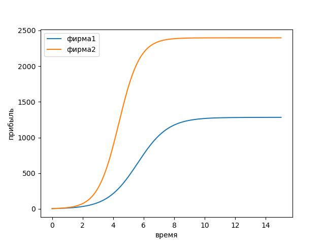
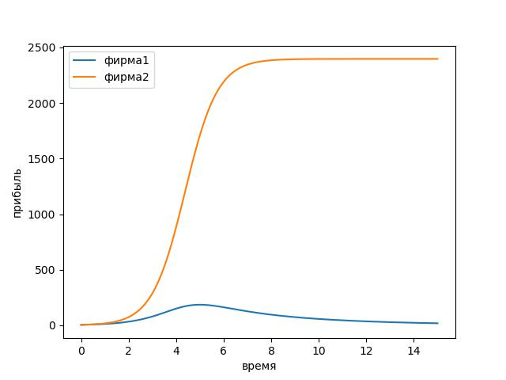
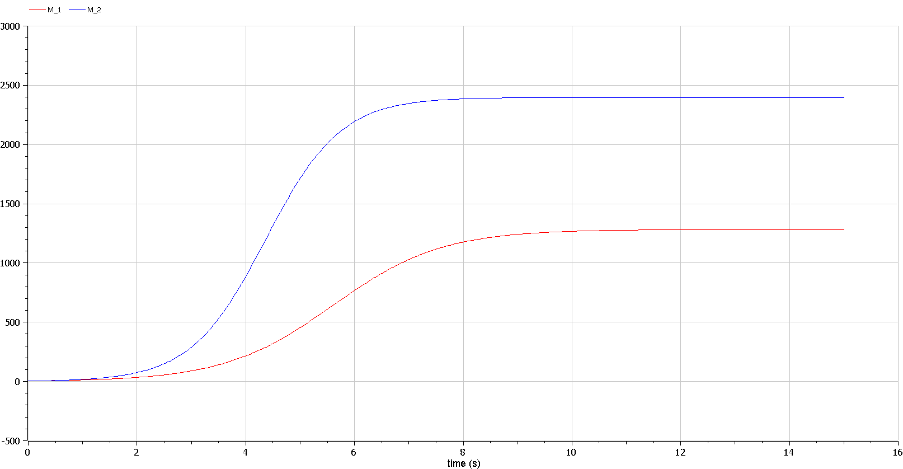
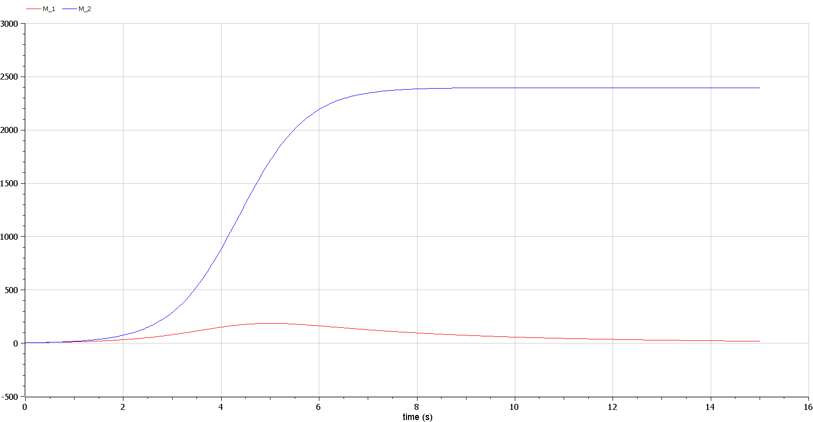

---
## Front matter
title: "Отчёт по лабораторной работе"
subtitle: "Лабораторная работа № 8"
author: "Живцова Анна"

## Generic otions
lang: ru-RU
toc-title: "Содержание"

## Bibliography
bibliography: bib/cite.bib
csl: pandoc/csl/gost-r-7-0-5-2008-numeric.csl

## Pdf output format
toc: true # Table of contents
toc-depth: 2
lof: true # List of figures
lot: true # List of tables
fontsize: 12pt
linestretch: 1.5
papersize: a4
documentclass: scrreprt
## I18n polyglossia
polyglossia-lang:
  name: russian
  options:
	- spelling=modern
	- babelshorthands=true
polyglossia-otherlangs:
  name: english
## I18n babel
babel-lang: russian
babel-otherlangs: english
## Fonts
mainfont: PT Serif
romanfont: PT Serif
sansfont: PT Sans
monofont: PT Mono
mainfontoptions: Ligatures=TeX
romanfontoptions: Ligatures=TeX
sansfontoptions: Ligatures=TeX,Scale=MatchLowercase
monofontoptions: Scale=MatchLowercase,Scale=0.9
## Biblatex
biblatex: true
biblio-style: "gost-numeric"
biblatexoptions:
  - parentracker=true
  - backend=biber
  - hyperref=auto
  - language=auto
  - autolang=other*
  - citestyle=gost-numeric
## Pandoc-crossref LaTeX customization
figureTitle: "Рис."
tableTitle: "Таблица"
listingTitle: "Листинг"
lofTitle: "Список иллюстраций"
lotTitle: "Список таблиц"
lolTitle: "Листинги"
## Misc options
indent: true
header-includes:
  - \usepackage{indentfirst}
  - \usepackage{float} # keep figures where there are in the text
  - \floatplacement{figure}{H} # keep figures where there are in the text
---

# Цель работы

Задать математическую модель конкуренции двух фирм с различными видами конкуренции. Изучить влияние видов конкуренции на формирование образа рынка.     

# Задание

N – число потребителей производимого продукта    
$\tau$ – длительность производственного цикла    
p – рыночная цена товара    
$\tilde p$ – себестоимость продукта, то есть переменные издержки на производство единицы продукции.    
q – максимальная потребность одного человека в продукте в единицу времени    
$\theta = \frac{t}{c_1}$ - безразмерное время  

$$ a_1 = \frac{p_{\sigma}}{\tau^2_1\tilde{p}^2_1Nq}, \ 
a_2 = \frac{p_{\sigma}}{\tau^2_2\tilde{p}^2_2Nq}, \ 
b = \frac{p_{\sigma}}{\tau^2_1\tilde{p}^2_1\tau^2_2\tilde{p}^2_2Nq}, \ 
c_1 = \frac{p_{\sigma}- \tilde{p}_1}{\tau_1\tilde{p}_1}, \ 
c_2 = \frac{p_{\sigma}- \tilde{p}_2}{\tau_2\tilde{p}_2}, \ 
$$    

1. Рассмотрим две фирмы, производящие взаимозаменяемые товары
одинакового качества и находящиеся в одной рыночной нише. Считаем, что в рамках
нашей модели конкурентная борьба ведётся только рыночными методами. То есть,
конкуренты могут влиять на противника путем изменения параметров своего
производства: себестоимость, время цикла, но не могут прямо вмешиваться в
ситуацию на рынке («назначать» цену или влиять на потребителей каким-либо иным
способом.) Будем считать, что постоянные издержки пренебрежимо малы, и в
модели учитывать не будем. В этом случае динамика изменения объемов продаж
фирмы 1 и фирмы 2 описывается следующей системой уравнений: 
\begin{align}
\begin{cases}
\frac{dM_1}{d\theta} = M_1 - \frac{b}{c_1}M_1M_2 - \frac{a_1}{c_1}M^2_1 \\
\frac{dM_2}{d\theta} = \frac{c_2}{c_1}M_2 - \frac{b}{c_1}M_1M_2 - \frac{a_2}{c_1}M^2_2
\end{cases}
\end{align}


2. Рассмотрим модель, когда, помимо экономического фактора
влияния (изменение себестоимости, производственного цикла, использование
кредита и т.п.), используются еще и социально-психологические факторы –
формирование общественного предпочтения одного товара другому, не зависимо от
их качества и цены. В этом случае взаимодействие двух фирм будет зависеть друг
от друга, соответственно коэффициент перед 1 2 MM будет отличаться. Пусть в
рамках рассматриваемой модели динамика изменения объемов продаж фирмы 1 и
фирмы 2 описывается следующей системой уравнений:
\begin{align}
\begin{cases}
\frac{dM_1}{d\theta} = M_1 - \left(\frac{b}{c_1} + 0.0005\right)M_1M_2 - \frac{a_1}{c_1}M^2_1 \\
\frac{dM_2}{d\theta} = \frac{c_2}{c_1}M_2 - \frac{b}{c_1}M_1M_2 - \frac{a_2}{c_1}M^2_2
\end{cases}
\end{align}

Начальные значения:
$$M_0^1 = 4.7 \text{ млн, } \ M^2_0 = 4.2 \text{ млн, } \ p_{\sigma} = 11.1\text{ тыс, } N = 32\text{ тыс, } q = 1$$
Параметры:
$$ \tau_1 = 17, \ tau_2 = 27, \ \tilde p_1 = 7.7\text{ тыс, } \tilde p_2 = 5.5\text{ тыс}$$

1. Постройте графики изменения оборотных средств фирмы 1 и фирмы 2 без учета постоянных издержек и с веденной нормировкой для случая 
2. Постройте графики изменения оборотных средств фирмы 1 и фирмы 2 без учета постоянных издержек и с веденной нормировкой для случая 

# Теоретическое введение

В математической модели конкуренции двух фирм @lit1, @lit2 @lit3 будем учитывать следующие величины, характеризующие состояние рынка:    
1.  N – число потребителей производимого продукта    
2. S – доходы потребителей данного продукта    
3. M – оборотные средства предприятия    
4. $\tau$ - длительность производственного цикла    
5. p – рыночная цена товара    
6. $\tilde p$ – себестоимость продукта, то есть переменные издержки на производство единицы продукции    
7. $\delta$ – доля оборотных средств, идущая на покрытие переменных издержек    
8. $\kappa$ – постоянные издержки, которые не зависят от количества выпускаемой продукции.    
Переводя законы развития рынка в формулы, получаем функцию спроса на товары
$$Q = q -k\frac{p}{S} = q\left(1 - \frac{p}{p_{\sigma}}\right)$$
k - мера эластичности функции спроса по цене    
Таким образом, функция спроса является пороговой и обладает свойствами насыщения.    
Уравнение для оборотных стредств 
$$ \frac{dM}{dt} = -\frac{M\delta}{\tau} + NQp - \kappa = -\frac{M\delta}{\tau} + Nq\left(1 - \frac{p}{p_{\sigma}}\right)p - \kappa$$
Уравнение для рыночной цены:    
$$ \frac{dp}{dt} = \gamma\left(-\frac{M\delta}{\tau\tilde p} + Nq\left(1 - \frac{p}{p_{\sigma}}\right)\right)$$

# Выполнение лабораторной работы

## Математическая постановка задачи

Для построения математической модели конкуренции двух фирм @lit1, @lit2 введем некоторые упрощающие предположения:    
1. Доходы всех потребителей одинаковы    
2. Рыночная цена товара устойчива (стационарна)    
3. Методы конкуренции    
  3.1 Для первого случая будем предполагать, что конкурентная борьба ведется только рыночными методами    
  3.2 Для второго случая будем учитывать социально-психологические факторы формирования общественного предпочтения.    

## Решение программными средствами

1.Решаем дифференциальное уравнение на языке Julia с использованием библиотеки DifferentialEquations. 
```julia
using PyPlot;
using DifferentialEquations;

function lorenz!(du,u,p,t)
    a1 = p[2]/p[1]/p[3]/p[3]/p[5]/p[5]
    a2 = p[2]/p[1]/p[4]/p[4]/p[6]/p[6]
    b = p[2]/p[1]/p[4]/p[4]/p[6]/p[6]/p[3]/p[3]/p[5]/p[5]
    c1 = (p[2] - p[5])/p[3]/p[5]
    c2 = (p[2] - p[6])/p[4]/p[6]
    du[1] = u[1] - b/c1*u[1]*u[2] - a1/c1*u[1]*u[1]
    du[2] =  c2/c1*u[2] - b/c1*u[1]*u[2] - a2/c1*u[2]*u[2]
end

u0 = [4.7, 4.2]
tspan = (0.0,  15.0)
p = [32, 11.1, 17, 27, 7.7, 5.5]
prob = ODEProblem(lorenz!,u0,tspan, p)
sol = solve(prob, reltol=1e-6,saveat=0.05);

plot(sol.t, sol.u, label = ["фирма1", "фирма2"])
legend()
xlabel("время")
ylabel("прибыль")
savefig("market1.jpg")
```

{#fig:01} 

```julia
function lorenz!(du,u,p,t)
    a1 = p[2]/p[1]/p[3]/p[3]/p[5]/p[5]
    a2 = p[2]/p[1]/p[4]/p[4]/p[6]/p[6]
    b = p[2]/p[1]/p[4]/p[4]/p[6]/p[6]/p[3]/p[3]/p[5]/p[5]
    c1 = (p[2] - p[5])/p[3]/p[5]
    c2 = (p[2] - p[6])/p[4]/p[6]
    du[1] = u[1] - b/c1*u[1]*u[2] - a1/c1*u[1]*u[1] - 0.0005*u[1]*u[2]
    du[2] =  c2/c1*u[2] - b/c1*u[1]*u[2] - a2/c1*u[2]*u[2]
end

prob1 = ODEProblem(lorenz!,u0,tspan, p)
sol1 = solve(prob1, reltol=1e-6,saveat=0.05);

plot(sol1.t, sol1.u, label = ["фирма1", "фирма2"])
legend()
xlabel("время")
ylabel("прибыль")
savefig("market2.jpg")
```

{#fig:02} 

2.Реализация задачи на языке OpenModelica 
```openmodelica
model market1
  Real M_1;
  Real M_2;
  Real a_1;
  Real a_2;
  Real b;
  Real c_1;
  Real c_2;
  parameter Real N = 32;
  parameter Real p_sigma = 11.1;
  parameter Real tau_1 = 17;
  parameter Real tau_2 = 27;
  parameter Real p_tilde_1 = 7.7;
  parameter Real p_tilde_2 = 5.5;
initial equation
  M_1 = 4.7;
  M_2 = 4.2;
equation
  a_1 = p_sigma/tau_1/tau_1/p_tilde_1/p_tilde_1/N;
  a_2 = p_sigma/tau_2/tau_2/p_tilde_2/p_tilde_2/N;
  b = p_sigma/tau_1/tau_1/p_tilde_1/p_tilde_1/N/tau_2/tau_2/p_tilde_2/p_tilde_2;
  c_1 = (p_sigma - p_tilde_1)/tau_1/p_tilde_1;
  c_2 = (p_sigma - p_tilde_2)/tau_2/p_tilde_2;
  //der(M_1) = M_1 - b/c_1*M_1*M_2 - a_1/c_1*M_1*M_1;
  //der(M_2) = c_2/c_1*M_2 - b/c_1*M_1*M_2 - a_2/c_1*M_2*M_2;
  der(M_1) = M_1 - (b/c_1 + 0.0005)*M_1*M_2 - a_1/c_1*M_1*M_1;
  der(M_2) = c_2/c_1*M_2 - b/c_1*M_1*M_2 - a_2/c_1*M_2*M_2;
end market1;
```

{#fig:03} 

{#fig:04}

Видим, что при рыночной конкуренции развитие фирм не зависит друг от друга, однако в условиях социально-психологического воздействия одна из фирм приходит к банкротству.    

# Выводы

Процессы развития фирм, отслеживаемые через показатель выручки, сильно зависят от установленного вида конкуренции. При взаимодействии в чистых рыночных условиях компании развиваются независимо (см. рис. @fig:01 , @fig:03 ). Тогда как при наличии социалььно-экономического фактора, одна из фирм приходит к банкротству (см. рис. @fig:02 , @fig:04 ).        

# Список литературы{.unnumbered}

::: {#refs}
:::   
